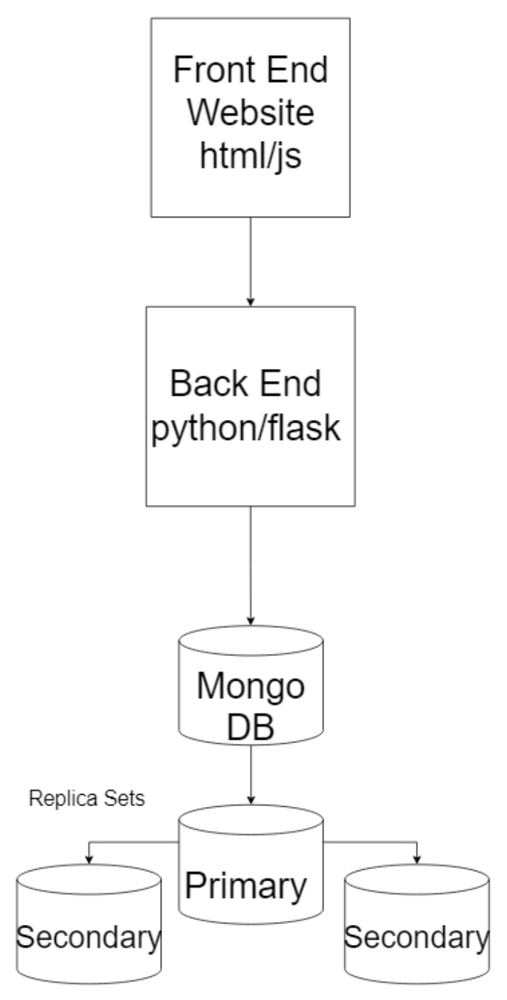

# recipe-similarity

### Summary

This system recommends the top recipes that best match the ingredients chosen by the user. The user inputs as many ingredients as they would like. The system will then suggest recipes, prioritizing those most relevant to college students —
specifically, recipes that use the fewest number of ingredients and the highest number of calories, because college
students are often on a budget and need to maximize their energy intake.

### Diagram

### Key Learnings

- MongoDB is useful for creating new calculated fields in a collection when querying data, such as the number of
  ingredients in a recipe.
- Using Flask to create a REST API was an easy way to create a simple web app that we could use to test how we
  queried with the database.
- Kaggle was a great source to find a dataset that we could use to test out our system.

### Fall-over Strategy

Our MongoDB is set up to have a replica set, which is a group of MongoDB servers that maintain the same data set,
providing redundancy and increasing data availability. With this, if one server were to fail, the other servers would
still be able to provide the data that we need for our application, and when the failed server is back up, it will
sync with the other servers to ensure that the data is consistent. With multiple replica sets, we can ensure that our
data will always be available.
